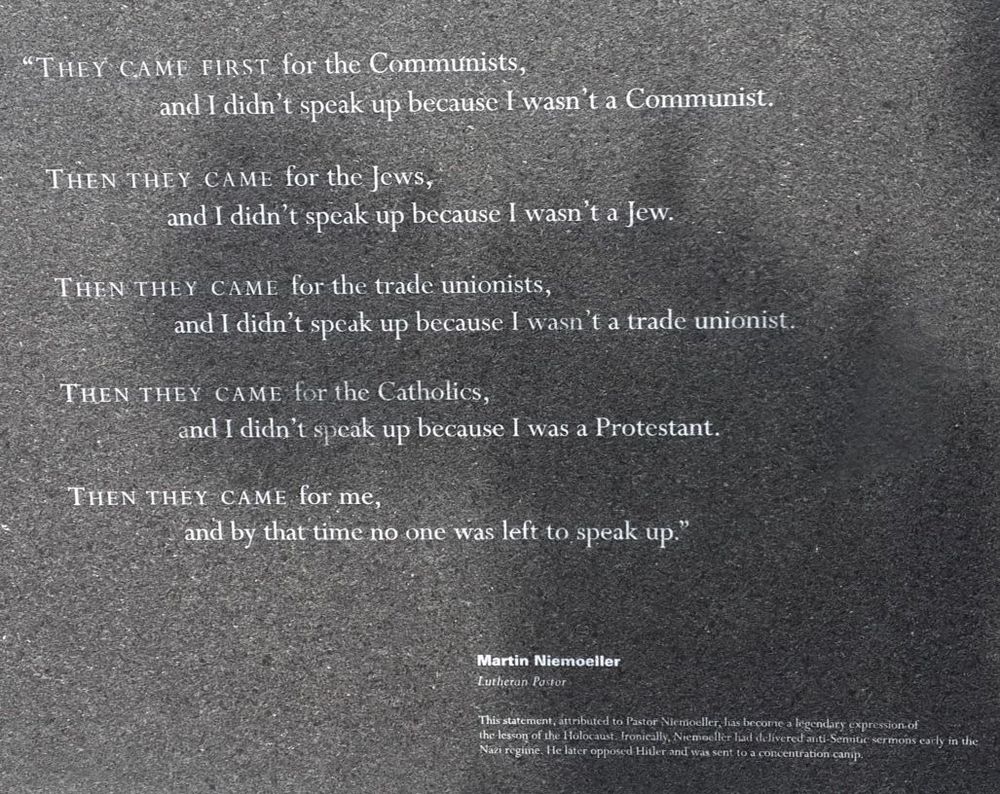

Dear Senate Minority Leader Chuck Schumer and House Minority Leader Hon. Hakeem Jeffries:

With a large Congressional delegation, please walk through what remains of the Jabaliya Refugee Camp in Gaza. Please see first-hand the wanton destruction that Rumeysa Ozturk spoke against in a column for the Tufts University newspaper (https://lnkd.in/eg2njPag) — exactly 364 days before plainclothes ICE agents abducted her this past Tuesday, just outside her home in Boston, Massachusetts.

No notice. No due process. Then they spirited her out of state — in likely violation, if not outright defiance, of a court order (https://lnkd.in/eWNae6hZ). In light of the hundreds of lawless and targeted renditions made by the United States security apparatus over these past two months — including approximately 300 Venezuelan asylum seekers deported without due process to El Salvador, in likely defiance of a federal court injunction — what they did to Rumeysa Ozturk on Tuesday appears to be no less than a kidnapping engineered to chill human rights advocacy.

Due process is a human right. As is living peacefully in a safe shelter that is not getting blown up. I want Congress to stand up for human rights this weekend, stay standing through the 2026 midterms, and never sit down again. Early next week, please publish a letter — signed by every Congressional Democrat — committing to join the delegation. Your caucus needs no majority. But it does need to show up.

זכרו — zichrú — remember the engraving of Martin Niemöller’s “First they came…” poem at the Holocaust memorial in Boston:

